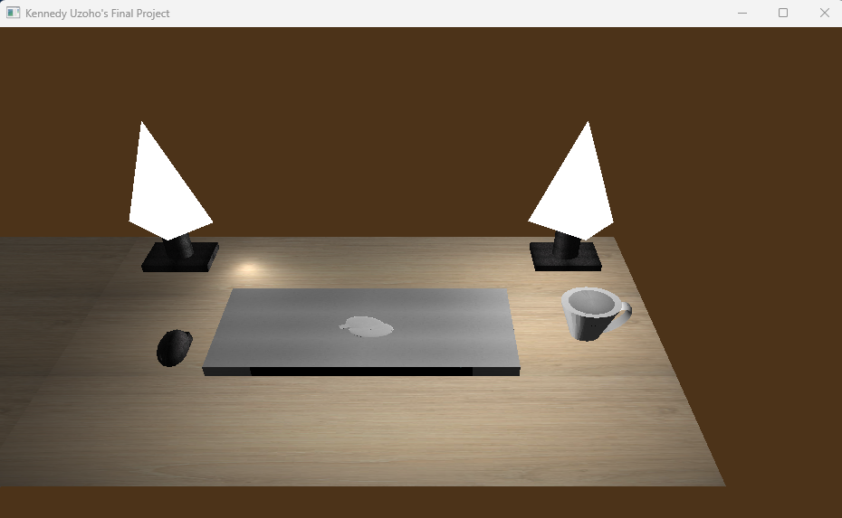
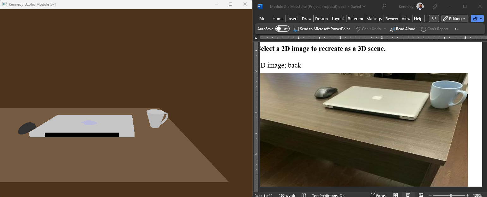
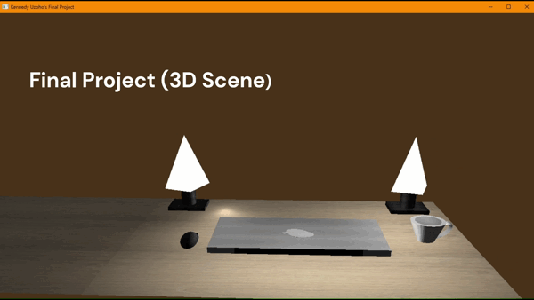
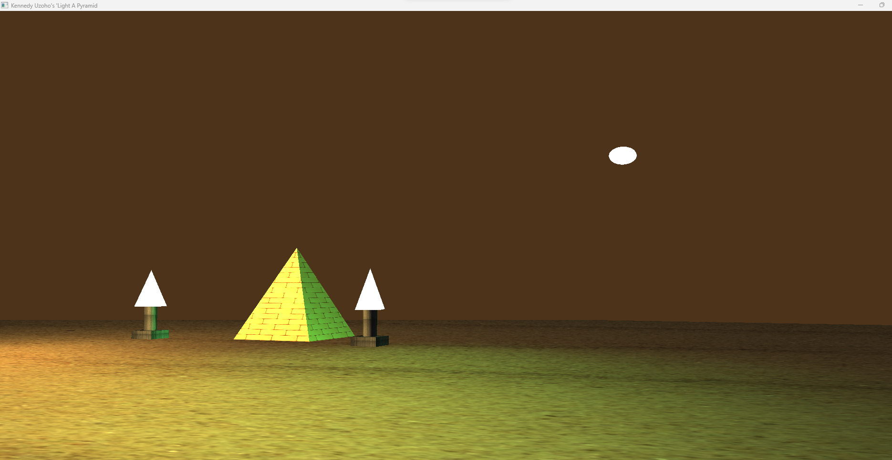

# CS-330_Portfolio

## Projects from CS-330 Computational Graphics and Visualization.

- [Design Decisions Document](https://github.com/kennedy-u/CS-330_Portfolio/blob/master/docs/Design%20_Document.pdf)
- [Scene Images](#scene-images)
  - [3D scene](#3d-scene)
  - [Source image](#scene-source-image)
  - [Scene animation](#scene-animation-3d)
  - [Pyramid](#pyramid--this-is-not-part-of-the-final-project)

## Scene Images

### 3D scene

### Scene source image

### Scene animation (3D)

### Pyramid.   (This is not part of the final project)

## Reflection

### How do I approach designing software?

Approaching software development and design involve a systematic and iterative process. At the initial stage, to understand the project requirements and objectives, I read through the requirements and identified the problems to be solved, I acknowledged the target audience, and any constraints or limitations. Working on this project has helped me hone several design skills. Through the design process, I understood the basics of system architecture, modular design, and component-based development. Additionally, I have learned to analyze and prioritize software design requirements by effectively communicating the design decisions and creating user-friendly interfaces. The implementation of this project enhanced my skills where I had to consider scalability, maintainability, and performance optimization.

Through the development process, I followed a well-defined design process. It began with a thorough requirement analysis, followed by conceptualizing the overall architecture and designing individual components. I used techniques such as UML diagrams, flowcharts, and wireframes to visualize and communicate the design. I iteratively refined the design based on feedback from the instructor and incorporated best practices for code organization, documentation, and testing. One of the tactics that helped me was breaking down complex problems into manageable components, prioritizing flexibility, and reusability. The tactics from my design approach can be applied in my future work by emphasizing the importance of requirements analysis and a systematic design process.

### How do I approach developing programs?

Developing this program involved a combination of planning, coding, testing, and iterative refinement. I started by understanding the problem domain and designing a solution. While working on the 3D scene, I employed various development strategies. I utilized object-oriented programming principles to organize code into reusable and maintainable classes. I practiced modular development, encapsulating functionality within individual components. Version control systems such as GitHub allowed for collaboration and tracking changes. Continuous integration and automated testing helped ensure the stability of the project.

### How can computer science help me in reaching my goals?

The knowledge I gained from this course can be applied in various professional pathways. For example, in data analysis, data visualizations can help in conveying insights and patterns effectively. In user interface design, understanding visual perception and interaction principles will enable the creation of intuitive and user-friendly interfaces. In specializations such as software architecture and product design, data visualization can aid in prototyping and presenting ideas.
